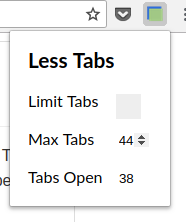

# Less Tabs

When only the favicons are visible on the tab bar, it can be a nightmare. Browser extension Less Tabs aims to reduce clutter and push users towards more conscious browsing by limiting number of open tabs.

Browsers Supported: Chrome, Firefox

## Installation

Requirements:
* Google Chrome / Firefox

#### Chrome

0. Clone this repo

1. Enter `chrome://extensions` into address bar and hit `enter`

2. Toggle on "Developer mode" on upper right hand corner

3. Click "Load unpacked" and navigate to repo directory 

4. Enter "less-tabs" subfolder then hit open 

Note: Please restart Chrome after installation

## Usage 

By default, limit tabs is disabled and limit set to 5 tabs. 

To enable limit tabs, click on extension icon and open popup. You will see th  following:

	

To enable, simply check the box. Also adjust the max tabs to your liking. Please note extra tabs will be closed, please save anything important!!
